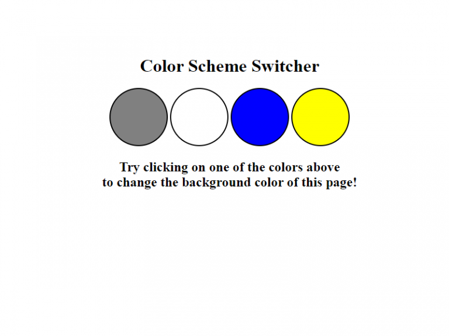

# Background Color Switcher

# Project Objective
The objective of this project is to code a four-button JavaScript background color switcher. The control switches are buttons with event listeners.

# JavaScript Used
* JavaScript conditionals
* JavaScript addEventListener property
* JavaScript CSS selectors
* JavaScript CSS manipulation

# New Things Learned or Refreshed
I used CSS to create the four control switch buttons. Then, I used the forEach loop to attach an eventListener to each of the buttons. Within the eventListener, I used some basic logic to change the background color of the page as each control button is clicked.I used Google one time to search. I had to remind myself how to actually use JavaScript to manipulate the CSS. Specifically, I went to W3Schools to remember how to code out the first part of the following line of code:
`body.style.backgroundColor = e.target.id;`